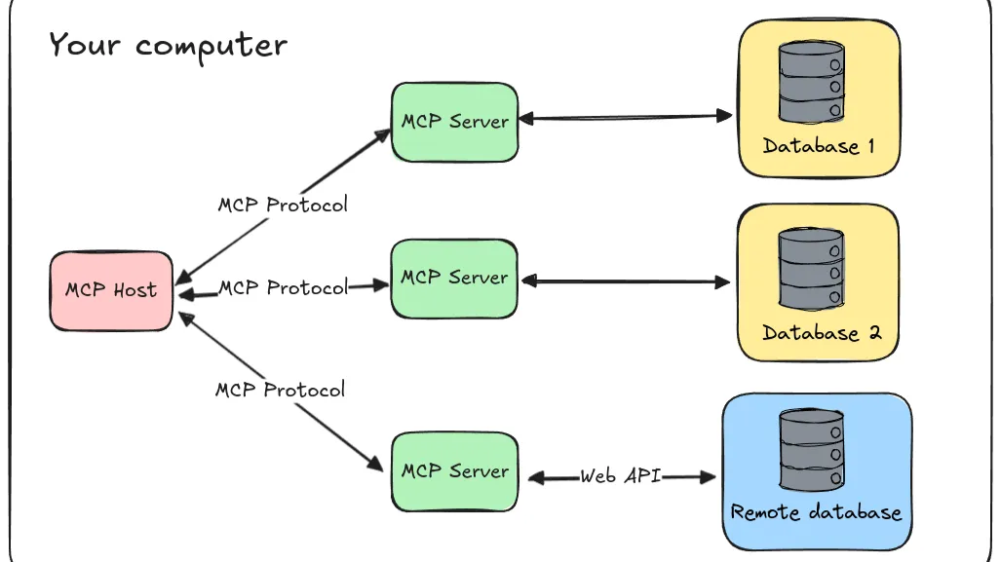
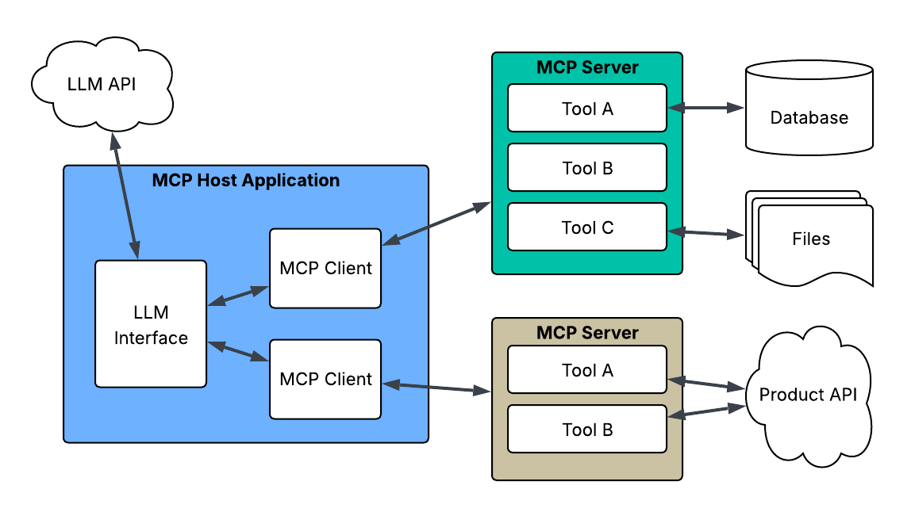

# IMCP (Industrial Model Context Protocol)
> An enhanced version of the Model Context Protocol (MCP) designed specifically for industrial applications, focusing on security, performance, and reliability. 


 [](LICENSE) [](https://www.python.org/) [](https://www.typescriptlang.org/) [](https://www.rust-lang.org/) [](https://www.iec.ch/)

## 📝 Overview

IMCP is based on the MCP architecture, optimized for industrial production scenarios with strict requirements for real-time performance, reliability, and security.



### 🌟 Key Improvements over MCP

1. **🔒 Enhanced Security**
   - Dual-key authentication (both client and server have public/private key pairs)
   - NaCl-based public/private key generation for all nodes
   - Digital signatures for all exchanged data
   - Secure key exchange using Curve25519
   - Message authentication using Poly1305

2. **⚡ Performance Optimization**
   - Binary protocol replacing JSON for better efficiency
   - Connection pooling for resource optimization
   - Asynchronous I/O for high throughput
   - Message compression support

3. **🏗️ Industrial Features**
   - Millisecond-level deterministic response
   - Full lifecycle security compliance
   - Support for industrial protocol stacks

## ✨ Features

- **🔑 Dual-Key Authentication**: Both client and server maintain their own public/private key pairs
- **🔒 Secure Communication**: Uses NaCl cryptography for end-to-end encryption
- **📦 Binary Protocol**: Efficient binary message format using MessagePack
- **⚡ Asynchronous I/O**: Built on asyncio for high-performance networking
- **🔄 Connection Pooling**: Efficient connection management
- **📝 Digital Signatures**: Message authentication using Ed25519
- **🌐 WebSocket Support**: Real-time bidirectional communication
- **🏭 Industrial-Grade Security**: Compliance with industrial security standards
- **🚀 High Performance**: Optimized for industrial real-time requirements

## 🔐 Security Architecture

IMCP implements a comprehensive security framework using NaCl cryptography:

### 🔑 Key Management
- **Node Authentication**: Each node (client/server) has its own public/private key pair
- **Public Key as Node Identifier**: Node's public key serves as its unique identifier
- **Key Exchange**: Curve25519 (Elliptic Curve Diffie-Hellman) for secure session key establishment
- **Symmetric Encryption**: XSalsa20 stream cipher for message encryption
- **Message Authentication**: Poly1305 MAC for message integrity
- **Digital Signatures**: Ed25519 (based on EdDSA) for message signing

### 🛡️ Security Features
- **Mutual Authentication**: Both parties verify each other's identity
- **End-to-End Encryption**: All messages are encrypted using session keys
- **Message Signing**: All messages are digitally signed by the sender
- **Session Key Management**: Secure session key generation and exchange

These algorithms are proven to resist:
- Side-channel attacks
- Timing attacks
- Other common security threats

## 🕹️ Operating Modes

IMCP supports two operating modes:

1. **💻 STDIO Mode (Local Operation)**
   - Used when client and server are on the same host
   - Optimized for local communication
   - Lower latency and higher throughput
   - Still maintains full security with key pairs

2. **🌐 SSE Mode (Remote Service)**
   - Used for remote client-server communication
   - Implements additional security measures
   - Optimized for network transmission
   - Full dual-key authentication

## 🚀 Installation

1. Clone the repository
```bash
   git clone https://github.com/arkCyber/IMCP.git
   cd IMCP
```
2. Install dependencies:
```bash
pip install -r requirements.txt
```


## 🗂️ Project Structure

- IMCP/
  - imcp-py/..............# Python implementation
  - imcp-ts/..............# TypeScript implementation
  - imcp-rs/..............# Rust implementation
  - imcp-analyzer/........# Protocol analyzer tool
  - docs/.................# Documentation
  - examples/.............# Example applications
  - assets/...............# Static assets

## 🖥️ Usage

### Starting the Server

```python
from imcp.server import IMCPServer

async def main():
    # Server generates its own key pair if not provided
    server = IMCPServer(host="0.0.0.0", port=8765)
    await server.start()

asyncio.run(main())
```

### Using the Client

```python
from imcp.client import IMCPClient

async def main():
    # Client generates its own key pair if not provided
    async with IMCPClient("ws://localhost:8765") as client:
        message = {
            "type": "request",
            "data": "Hello, IMCP Server!"
        }
        await client.send(message)
        response = await client.receive()
        print(response)

asyncio.run(main())
```

#### 🔐 Security Features

- **Dual-Key System**: Both client and server maintain their own key pairs
- **Key Exchange**: Curve25519 for secure key exchange
- **Encryption**: XSalsa20 for symmetric encryption
- **Authentication**: Ed25519 for digital signatures
- **Message Integrity**: Poly1305 for message authentication
- **Secure Session Management**: Connection pooling with session keys
- **End-to-End Encryption**: All messages are encrypted in transit
- **Mutual Authentication**: Both parties verify each other's identity

#### 🚀 Performance Optimizations

- Binary protocol using MessagePack
- Connection pooling
- Asynchronous I/O with asyncio
- Efficient message serialization
- Message compression support
- Optimized network transmission


#### 🎯 Industrial Applications

IMCP is designed for various industrial scenarios:

- **🏭 Manufacturing**: Real-time control and monitoring
- **⚡ Energy**: Power grid management and monitoring
- **🚦 Transportation**: Traffic control and management
- **🏥 Healthcare**: Medical device communication
- **🏙️ Smart Cities**: Infrastructure management

## 🏛️ Compliance and Standards

IMCP is designed to comply with:
- GDPR
- HIPAA
- IEC 62443
- Other relevant industrial security standards

## 🤝 Contributing

We welcome contributions of all kinds! Whether you want to fix bugs, improve documentation, or propose new features.

## 📄 License

This project is licensed under the MIT License - see the [LICENSE](LICENSE) file for details.

## ☕ Support

If you find this project helpful and would like to support its development, consider buying me a coffee! Your support helps maintain and improve this project.

[](https://www.buymeacoffee.com/arkSong)

## 🐛 Issue Reporting

Found a bug or have a feature request? Please help us by:

1. Checking the [existing issues](https://github.com/arkCyber/IMCP/issues) to avoid duplicates
2. Creating a new issue with:
   - A clear title and description
   - Steps to reproduce (for bugs)
   - Expected vs actual behavior
   - Environment details (OS, version, etc.)

For security-related issues, please email security@imcp.dev instead of creating a public issue.

## 🙏 Acknowledgments

Thanks to all contributors and the open source community. Special thanks to:
- [MCP](https://github.com/modelcontextprotocol) for the base protocol
- [NaCl](https://doc.libsodium.org/) for cryptography
- [WebSocket](https://websockets.readthedocs.io/) for real-time communication
- [MessagePack](https://msgpack.org/) for binary serialization

## 📚 References
- [Model Context Protocol](https://github.com/modelcontextprotocol) - Base protocol architecture
- [WebSocket Protocol](https://websockets.readthedocs.io/) - Real-time communication
- [MessagePack](https://msgpack.org/) - Efficient binary serialization
- [NaCl (libsodium)](https://doc.libsodium.org/) - Cryptographic operations
- [asyncio](https://docs.python.org/3/library/asyncio.html) - Asynchronous I/O
